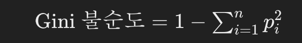

**[공지사항]** [지킬블로그 안내드립니다.](https://mmistakes.github.io/minimal-mistakes/docs/quick-start-guide/)
{: .notice--warning}

지킬 블로그에 대하여 알아보겠습니다.
{: .align-right}   
<!-- 오른쪽정렬 -->
[버튼입니다](https://google.com){: .btn .btn--info}

## Gini 불순도란?

Gini 불순도는 분류 문제에서 의사 결정 나무 알고리즘을 사용할 때 중요한 개념입니다. Gini 불순도는 특정 노드에서 데이터 샘플의 혼합도를 측정하는 지표로, 샘플들이 서로 다른 클래스에 얼마나 섞였는지를 나타냅니다. 

예를 들어, 통 안에 여러 개의 색깔이 섞여 있는 구슬이 있다고 가정해봅시다. 눈으로 봤을 때는 색깔이 얼마나 섞여 있는지 알 수 없지만, Gini 불순도를 계산하면 이를 수치화할 수 있습니다.

#### 𝑝𝑖는 클래스 𝑖의 비율입니다.

